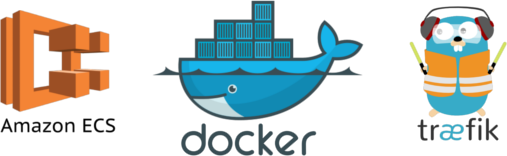

# Docker ECS Sample App



## Key Features

*   Simple Docker based deployment to ECS Clusters
*   Full environment support for docker-compose.yml
*   Allows full ECS Task control such as VPC endpoints in `ecs-params.yml`
*   Cross platform

## Initial Setup

To clone and run this application, you'll need [Git](https://git-scm.com)

From the command line:

```bash
git clone git@github.com:tyro-private/docker-ecs-deploy-sample.git <your_app_name>
```

Inside this will be the following layout:

| Name                                    | Description                                                             |
| --------------------------------------- | ----------------------------------------------------------------------- |
| `.buildkite`                            | Generic directory for managing BuildKite build config                   |
| `.buildkite/pipeline.yaml`              | Configuration for your BuildKite pipeline and environment deployemnts   |
| `.buildkite/scripts/policy.json`        | A JSON policy configuration for which accounts can access your ECR repo |
| `.buildkite/scripts/deploy.env`         | Base-configuration for your service                                     |
| `.buildkite/scripts/ecs-params.yml`     | Base configuration for your service's ECS specific config               |
| `.buildkite/scripts/docker-compose.yml` | A docker-compose file describing your service configuration             |
| `.buildkite/scripts/build.sh`           | Build script for a standard Docker container                            |
| `.buildkite/scripts/deploy.sh`          | Deployment script for pushing a service to an ECS cluster               |

## Configuration

Your repo will require some configuration to suit your Docker container.

### .buildkite/pipeline.yaml

This can be configured to how your software normally builds a Docker container.

The following variables should be configured:

*   `IMAGE_NAME`: This should be the name of your service and Docker image name.
*   `IMAGE_VERSION`: This should be the versioning pattern of your Docker service. This can either be configured globally in the top level `env`
    or your pipeline can declare it in-line with its own custom config.
*   `ECS_TASK_NAME`: This is the name your Service and Task definition will be created as.
*   `ECS_CLUSTER_NAME`: This is the name of the cluster you are targeting (default `cluster-evc` is okay if you are not using your own)
*   `TRAEFIK_ENVIRONMENT` This is the cluster host slice for the particular environment (eg. `evc.dev`, `evc.staging`, etc.)

### .buildkite/scripts/policy.json

This is configured by default to allow all accounts to pull your Docker ECR Repo (Sandpit/Dev/Stage/Prod).
Add or remove acounts as needed.

### .buildkite/scripts/deploy.env

This contains any default settings you wish to use as explicit environment variables in your `docker-compose.yml`. The following
settings need to be changed to reflect your app:

| Variable Name           | Description                                                                                                                                               | Default      |
| ----------------------- | --------------------------------------------------------------------------------------------------------------------------------------------------------- | ------------ |
| `LOG_GROUP`             | This is the main logging group in CloudWatch your app will log to.                                                                                        | `ecs-evc`    |
| `LOG_STREAM_PREFIX`     | This is the prefix your ECS service service will prepend your CloudWatch logs to (group/prefix/task_name)                                                 | `sample_app` |
| `ECS_DESIRED_COUNT`     | The number of instances of your service you would like to run                                                                                             | `1`          |
| `DOCKER_CONTAINER_PORT` | The port the service your Docker container exposes internally.                                                                                            | `8080`       |
| `DOCKER_CPU`            | The number of CPUs your Docker service wishes to allocate to itself. Your service will not deploy if there is not enouch capacity. 0 to disable.          | `0`          |
| `DOCKER_MEMORY`         | The amount of memory your Docker service wishes to allocate to itself. Your service will not deploy if there is not enouch capacity. _Required to be set_ | `524288`     |
| `TRAEFIK_HOSTNAME`      | The host prefix your app registers under. This _MUST BE UNIQUE_ otherwise your app will be unreachable.                                                   | `sample-app` |
| `TRAEFIK_DOMAIN`        | The domain your ECS cluster is configured for. Default should be okay if using standard ECS service.                                                      | `tyro.cloud` |
| `TRAEFIK_HEALTHCHECK`   | The path your service exposes a health check on. This must return a HTTP 200-299 response.                                                                | `/health`    |
| `TRAEFIK_PROTOCOL`      | The protocol your service speaks (http or https). Certs are not currently validated but will be in the future\*.                                          | `http`       |

### .buildkite/scripts/ecs-params.yml

This is the configuration parameters for your ECS Service and Task. This can be used to configure things like Task level CPU/Memory limitations and AWSVPC Subnet and Security Group configuration.

We run a dev version of the tool that allows you to use environment variables in your ecs-deploy.yml.

See the [ECS CLI GitHub Docs](https://github.com/aws/amazon-ecs-cli#using-ecs-parameters) for full configuration parameters.

### .buildkite/scripts/docker-compose.yml

This is the service definition for your application. Most of the defaults in this service are parameterised to your `deploy.env` file.

If you wish to extend this file, the [ECS Command Line Reference Docs](https://docs.aws.amazon.com/AmazonECS/latest/developerguide/cmd-ecs-cli-compose-service.html) contain the changable parameters.

A common configuration change would be to add an environment variable to a Docker runtime. This would require adding an additional entry into the `env:` key (such as the example `NGINX_PORT`). To set a service-wide default, add the varaible to `deploy.env`. If you wish to set a per-environment variable at deploy time then an additional entry to the `ECS_CLI` variable in `.scripts/deploy.sh`.

There is also a configuration key `labels` which contains the Traefik Docker labels required to route traffic to your service. These can be extended further as per the [Traefic ECS Label Docs](https://docs.traefik.io/configuration/backends/ecs/#labels-overriding-default-behaviour)

### .buildkite/scripts/deploy.sh

This should not require changing unless an additional environment variable is required as per above.

### .buildkite/scripts/build.sh

This should not require changing unless an additional environment variable is required as per above.

This will publish a docker container to the Build account repo in the format:
`${ACCOUNT_ID_BUILD}.dkr.ecr.ap-southeast-2.amazonaws.com/${IMAGE_NAME}:${IMAGE_VERSION}`

## Customization

### Running non-web services

The ECS cluster can also run standard tasks without Traefik endpoints. Simply remove the Traefik labels from `docker-compose.yml` if you wish to run a headless service.

## Testing

### Sandpit

The sample app service can be deployed to the Sandpit account if you have FullAdmin access with the following command:

```bash
ECS_CLUSTER_NAME=cluster-evc \
ECS_TASK_NAME=sample-app \
IMAGE_NAME=sample-app \
IMAGE_VERSION=latest \
TRAEFIK_ENVIRONMENT=evc.sandpit \
.buildkite/scripts/deploy.sh
```

This will then be available at `https://$TRAEFIK_HOSTNAME.evc.sandpit.tyro.cloud`

Your app can also be deployed to the Sandpit account too if you have a Docker image built and subsitute `IMAGE_NAME` and `IMAGE_VERSION` for your appropriate vars.

### Target Accounts

Once your application has been deployed it will be available at `https://$TRAEFIK_HOSTNAME.$TRAEFIK_ENVIRONMENT.$TRAEFIK_DOMAIN`.

## Troubleshooting

### Cloudwatch

Cloudwatch will have your application logs under the `$LOG_GROUP/$LOG_STREAM_PREFIX` in each account. Anything your application streams to STDOUT will show up here.

### Checking Traefik

The Traefik read-only backend can be found in the following locations. This will show all active services:

*   [Sandpit Traefik](https://traefik.evc.sandpit.tyro.cloud)
*   [Dev Traefik](https://traefik.evc.dev.tyro.cloud)
*   [Staging Traefik](https://traefik.evc.staging.tyro.cloud)
*   [Prod Traefik](https://traefik.evc.tyro.cloud)
